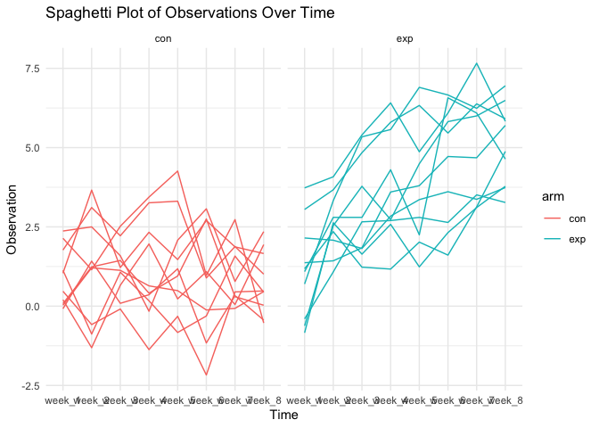

Homework 5
================
Wenyu Zhang
2023-11-08

# Problem 1

``` r
homicide = 
  read_csv("./homicide-data.csv") |> 
  mutate(city_state = paste(city, state, sep = ", "))
```

    ## Rows: 52179 Columns: 12
    ## ── Column specification ────────────────────────────────────────────────────────
    ## Delimiter: ","
    ## chr (9): uid, victim_last, victim_first, victim_race, victim_age, victim_sex...
    ## dbl (3): reported_date, lat, lon
    ## 
    ## ℹ Use `spec()` to retrieve the full column specification for this data.
    ## ℹ Specify the column types or set `show_col_types = FALSE` to quiet this message.

The raw `homicide` data includes 52179 observations and 13 variables
after adding the new `city_state` variable. Among all the variables,
`disposition` variable helps to tell whether the case is solved or
unsolved. It can be used in the later manipulation on the dataset for
separating into two different groups and do simulations to find
estimates and confidence intervals. Also, the dataset includes the
accurate age and sex of victims, which represented by `victim_age` and
`victim_sex` variables. These variables are also helpful to perform
similar simulations like `disposition` variables in the future.

``` r
city_summary =
  homicide |> 
  group_by(city_state) |> 
  summarize(total_homicide = n(),
            unsolved_homicide = 
              sum(disposition %in% c("Closed without arrest", "Open/No arrest")))
```

``` r
BMD_data = 
  city_summary |> 
  filter(city_state == "Baltimore, MD")
BMD_test = prop.test(BMD_data$unsolved_homicide, BMD_data$total_homicide) |> 
  broom::tidy() |> 
  select(estimate, conf.low, conf.high)
```

``` r
all_cities_test =
  city_summary |> 
  mutate(prop_test = map2(unsolved_homicide, total_homicide, ~prop.test(.x, .y))) |> 
  mutate(tidy_test = map(prop_test, broom::tidy)) |> 
  unnest(tidy_test) |> 
  select(city_state, estimate, conf.low, conf.high)
```

    ## Warning: There was 1 warning in `mutate()`.
    ## ℹ In argument: `prop_test = map2(unsolved_homicide, total_homicide,
    ##   ~prop.test(.x, .y))`.
    ## Caused by warning in `prop.test()`:
    ## ! Chi-squared approximation may be incorrect

``` r
all_cities_test |> 
  ggplot(aes(x = reorder(city_state, -estimate), y = estimate)) +
  geom_point() +
  geom_errorbar(aes(ymin = conf.low, ymax = conf.high), width = 0.2) +
  coord_flip() +
  labs(x = "City", y = "Proportion of Unsolved Homicides") +
  theme_minimal()
```

<!-- -->

# Problem 2

``` r
file_names = list.files(path = "./data", full.names = TRUE)
files_data = map(file_names, read_csv)
```

    ## Rows: 1 Columns: 8
    ## ── Column specification ────────────────────────────────────────────────────────
    ## Delimiter: ","
    ## dbl (8): week_1, week_2, week_3, week_4, week_5, week_6, week_7, week_8
    ## 
    ## ℹ Use `spec()` to retrieve the full column specification for this data.
    ## ℹ Specify the column types or set `show_col_types = FALSE` to quiet this message.
    ## Rows: 1 Columns: 8
    ## ── Column specification ────────────────────────────────────────────────────────
    ## Delimiter: ","
    ## dbl (8): week_1, week_2, week_3, week_4, week_5, week_6, week_7, week_8
    ## 
    ## ℹ Use `spec()` to retrieve the full column specification for this data.
    ## ℹ Specify the column types or set `show_col_types = FALSE` to quiet this message.
    ## Rows: 1 Columns: 8
    ## ── Column specification ────────────────────────────────────────────────────────
    ## Delimiter: ","
    ## dbl (8): week_1, week_2, week_3, week_4, week_5, week_6, week_7, week_8
    ## 
    ## ℹ Use `spec()` to retrieve the full column specification for this data.
    ## ℹ Specify the column types or set `show_col_types = FALSE` to quiet this message.
    ## Rows: 1 Columns: 8
    ## ── Column specification ────────────────────────────────────────────────────────
    ## Delimiter: ","
    ## dbl (8): week_1, week_2, week_3, week_4, week_5, week_6, week_7, week_8
    ## 
    ## ℹ Use `spec()` to retrieve the full column specification for this data.
    ## ℹ Specify the column types or set `show_col_types = FALSE` to quiet this message.
    ## Rows: 1 Columns: 8
    ## ── Column specification ────────────────────────────────────────────────────────
    ## Delimiter: ","
    ## dbl (8): week_1, week_2, week_3, week_4, week_5, week_6, week_7, week_8
    ## 
    ## ℹ Use `spec()` to retrieve the full column specification for this data.
    ## ℹ Specify the column types or set `show_col_types = FALSE` to quiet this message.
    ## Rows: 1 Columns: 8
    ## ── Column specification ────────────────────────────────────────────────────────
    ## Delimiter: ","
    ## dbl (8): week_1, week_2, week_3, week_4, week_5, week_6, week_7, week_8
    ## 
    ## ℹ Use `spec()` to retrieve the full column specification for this data.
    ## ℹ Specify the column types or set `show_col_types = FALSE` to quiet this message.
    ## Rows: 1 Columns: 8
    ## ── Column specification ────────────────────────────────────────────────────────
    ## Delimiter: ","
    ## dbl (8): week_1, week_2, week_3, week_4, week_5, week_6, week_7, week_8
    ## 
    ## ℹ Use `spec()` to retrieve the full column specification for this data.
    ## ℹ Specify the column types or set `show_col_types = FALSE` to quiet this message.
    ## Rows: 1 Columns: 8
    ## ── Column specification ────────────────────────────────────────────────────────
    ## Delimiter: ","
    ## dbl (8): week_1, week_2, week_3, week_4, week_5, week_6, week_7, week_8
    ## 
    ## ℹ Use `spec()` to retrieve the full column specification for this data.
    ## ℹ Specify the column types or set `show_col_types = FALSE` to quiet this message.
    ## Rows: 1 Columns: 8
    ## ── Column specification ────────────────────────────────────────────────────────
    ## Delimiter: ","
    ## dbl (8): week_1, week_2, week_3, week_4, week_5, week_6, week_7, week_8
    ## 
    ## ℹ Use `spec()` to retrieve the full column specification for this data.
    ## ℹ Specify the column types or set `show_col_types = FALSE` to quiet this message.
    ## Rows: 1 Columns: 8
    ## ── Column specification ────────────────────────────────────────────────────────
    ## Delimiter: ","
    ## dbl (8): week_1, week_2, week_3, week_4, week_5, week_6, week_7, week_8
    ## 
    ## ℹ Use `spec()` to retrieve the full column specification for this data.
    ## ℹ Specify the column types or set `show_col_types = FALSE` to quiet this message.
    ## Rows: 1 Columns: 8
    ## ── Column specification ────────────────────────────────────────────────────────
    ## Delimiter: ","
    ## dbl (8): week_1, week_2, week_3, week_4, week_5, week_6, week_7, week_8
    ## 
    ## ℹ Use `spec()` to retrieve the full column specification for this data.
    ## ℹ Specify the column types or set `show_col_types = FALSE` to quiet this message.
    ## Rows: 1 Columns: 8
    ## ── Column specification ────────────────────────────────────────────────────────
    ## Delimiter: ","
    ## dbl (8): week_1, week_2, week_3, week_4, week_5, week_6, week_7, week_8
    ## 
    ## ℹ Use `spec()` to retrieve the full column specification for this data.
    ## ℹ Specify the column types or set `show_col_types = FALSE` to quiet this message.
    ## Rows: 1 Columns: 8
    ## ── Column specification ────────────────────────────────────────────────────────
    ## Delimiter: ","
    ## dbl (8): week_1, week_2, week_3, week_4, week_5, week_6, week_7, week_8
    ## 
    ## ℹ Use `spec()` to retrieve the full column specification for this data.
    ## ℹ Specify the column types or set `show_col_types = FALSE` to quiet this message.
    ## Rows: 1 Columns: 8
    ## ── Column specification ────────────────────────────────────────────────────────
    ## Delimiter: ","
    ## dbl (8): week_1, week_2, week_3, week_4, week_5, week_6, week_7, week_8
    ## 
    ## ℹ Use `spec()` to retrieve the full column specification for this data.
    ## ℹ Specify the column types or set `show_col_types = FALSE` to quiet this message.
    ## Rows: 1 Columns: 8
    ## ── Column specification ────────────────────────────────────────────────────────
    ## Delimiter: ","
    ## dbl (8): week_1, week_2, week_3, week_4, week_5, week_6, week_7, week_8
    ## 
    ## ℹ Use `spec()` to retrieve the full column specification for this data.
    ## ℹ Specify the column types or set `show_col_types = FALSE` to quiet this message.
    ## Rows: 1 Columns: 8
    ## ── Column specification ────────────────────────────────────────────────────────
    ## Delimiter: ","
    ## dbl (8): week_1, week_2, week_3, week_4, week_5, week_6, week_7, week_8
    ## 
    ## ℹ Use `spec()` to retrieve the full column specification for this data.
    ## ℹ Specify the column types or set `show_col_types = FALSE` to quiet this message.
    ## Rows: 1 Columns: 8
    ## ── Column specification ────────────────────────────────────────────────────────
    ## Delimiter: ","
    ## dbl (8): week_1, week_2, week_3, week_4, week_5, week_6, week_7, week_8
    ## 
    ## ℹ Use `spec()` to retrieve the full column specification for this data.
    ## ℹ Specify the column types or set `show_col_types = FALSE` to quiet this message.
    ## Rows: 1 Columns: 8
    ## ── Column specification ────────────────────────────────────────────────────────
    ## Delimiter: ","
    ## dbl (8): week_1, week_2, week_3, week_4, week_5, week_6, week_7, week_8
    ## 
    ## ℹ Use `spec()` to retrieve the full column specification for this data.
    ## ℹ Specify the column types or set `show_col_types = FALSE` to quiet this message.
    ## Rows: 1 Columns: 8
    ## ── Column specification ────────────────────────────────────────────────────────
    ## Delimiter: ","
    ## dbl (8): week_1, week_2, week_3, week_4, week_5, week_6, week_7, week_8
    ## 
    ## ℹ Use `spec()` to retrieve the full column specification for this data.
    ## ℹ Specify the column types or set `show_col_types = FALSE` to quiet this message.
    ## Rows: 1 Columns: 8
    ## ── Column specification ────────────────────────────────────────────────────────
    ## Delimiter: ","
    ## dbl (8): week_1, week_2, week_3, week_4, week_5, week_6, week_7, week_8
    ## 
    ## ℹ Use `spec()` to retrieve the full column specification for this data.
    ## ℹ Specify the column types or set `show_col_types = FALSE` to quiet this message.

``` r
longitutional_study = tibble(file_names, files_data)
```

``` r
longitutional_study =
  longitutional_study |> 
  mutate(file_names = str_extract(file_names, "[a-z]{1,3}_\\d\\d"),
         arm = str_extract(file_names, "[a-z]{1,3}")) |> 
  unnest(cols = c(files_data)) |> 
  select(file_names, arm, everything()) |> 
  pivot_longer(cols = starts_with("week"),
               names_to = "time",
               values_to = "observations")
```

``` r
longitutional_study |> 
  ggplot(aes(x = time, y = observations, group = file_names, color = arm)) +
  geom_line() +
  theme_minimal() +
  facet_grid(~arm) +
  labs(title = "Spaghetti Plot of Observations Over Time", x = "Time", y = "Observation")
```

<!-- -->

Based on the Spaghetti plot we made from the dataset, we noticed that
the experimental group have an overall better performence compared with
the control group. The trend of two groups are different. For
experimental group, the overall tendency has a positive slope, which
indicates a positive relation between two variables. Whereas control
group appears a horizontal trend. This helps to investigates the out
compete performence of experimental group.

# Problem 3

``` r
sim_mean_p = function(mu, n = 30, sigma = 5) {
  sim_data = tibble(
    x = rnorm(n, mean = mu, sd = sigma)
  )
  sim_data |> 
    summarise(
      mu_hat = pull(broom::tidy(t.test(x, mu = 0, conf.level = 0.05)), estimate),
      p_value = pull(broom::tidy(t.test(x, mu = 0, conf.level = 0.05)), p.value)
    )
}
```

``` r
output = vector("list", 5000)

for (i in 1:5000) {
  output[[i]] = sim_mean_p(0)
}
sim_result_df = 
  expand_grid(
    mu = 0,
    iter = 1:5000
  ) |> 
  mutate(
    estimate_df = map(mu, sim_mean_p)
  ) |> 
  unnest(estimate_df)
```

``` r
sim_results_df = 
  expand_grid(
    diff_mu = c(0:6),
    iter = 1:5000
  ) |> 
  mutate(
    estimate_df = map(diff_mu, sim_mean_p)
  ) |> 
  unnest(estimate_df)
```

``` r
sim_summary = 
  sim_results_df |> 
  group_by(diff_mu) |> 
  summarise(
    power = mean(p_value < 0.05),
    avg_mu_hat = mean(mu_hat),
    avg_rej_mu_hat = mean(mu_hat[p_value < 0.05])
  )
```

``` r
sim_summary |> 
  ggplot(aes(x = diff_mu, y = power)) +
  geom_line() +
  labs(title = "Power vs. true mean", x= "True mean", y = "Power")
```

<!-- -->

From the graph we plotted, we noticed that as the true mean(effect size)
increases, the power increases. The plot we obtain indicates a positive
relation between the true mean and power of the test. So, they have a
positive relations, which proves the double increasing phenomena.

``` r
sim_summary |> 
  ggplot(aes(x = diff_mu)) +
  geom_line(aes(y = avg_mu_hat), color = "blue") +
  geom_line(aes(y = avg_rej_mu_hat), color = "red") +
  labs(title = "Average estimate vs true mean", x = "True mean", y = "Average estimate of mu")
```

<!-- -->

We can say that the sample average across tests for which the null is
rejected approximately equal to the true value of mean. From the graph,
we can tell that when the true mean is small (around 0-2), the two lines
are not coherently adhesive to each other, but they share the same
trends. As the true mean increases, trends of two lines are getting
closer, and finally overlapping. So, based on all the observations, we
can imply that mu hat is approximately equals to mu.
